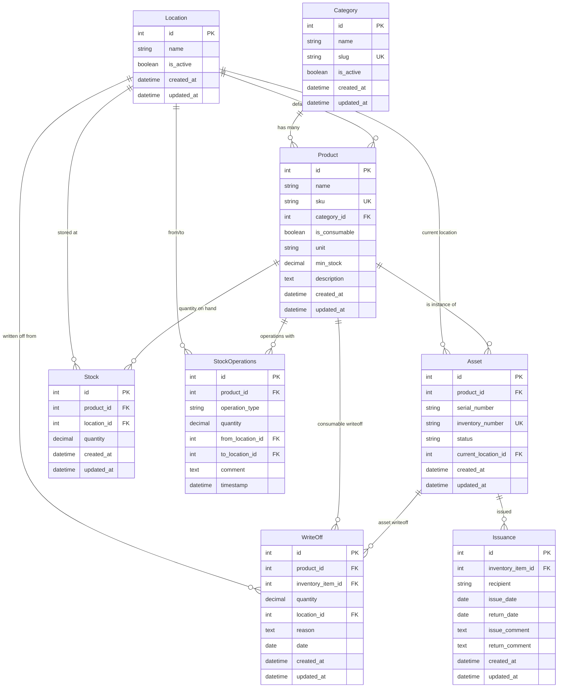

# Схема базы данных OfficeAssets

## Содержание
- [ER-диаграмма](#er-диаграмма)
- [Описание таблиц](#описание-таблиц)
- [Индексы](#индексы)
- [Ограничения](#ограничения)

---

## ER-диаграмма



---

## Описание таблиц

### 1. Category (Категории)

Справочник категорий товаров и техники.

| Поле | Тип | Описание | Ограничения |
|------|-----|----------|-------------|
| id | INTEGER | Первичный ключ | PK, AUTO_INCREMENT |
| name | VARCHAR(255) | Название категории | NOT NULL |
| slug | VARCHAR(255) | URL-friendly название | UNIQUE, NOT NULL |
| is_active | BOOLEAN | Активна ли категория | DEFAULT TRUE |
| created_at | TIMESTAMP | Дата создания | AUTO |
| updated_at | TIMESTAMP | Дата обновления | AUTO |

**Примеры:**
- Компьютерная техника
- Оргтехника
- Канцелярия
- Мебель

---

### 2. Location (Локации)

Справочник мест хранения и размещения.

| Поле | Тип | Описание | Ограничения |
|------|-----|----------|-------------|
| id | INTEGER | Первичный ключ | PK, AUTO_INCREMENT |
| name | VARCHAR(255) | Название локации | NOT NULL |
| is_active | BOOLEAN | Активна ли локация | DEFAULT TRUE |
| created_at | TIMESTAMP | Дата создания | AUTO |
| updated_at | TIMESTAMP | Дата обновления | AUTO |

**Примеры:**
- Главный склад
- Офис - 2 этаж
- Кабинет директора
- Серверная

---

### 3. Product (Товары)

Каталог всех товаров (техника и расходники).

| Поле | Тип | Описание | Ограничения |
|------|-----|----------|-------------|
| id | INTEGER | Первичный ключ | PK, AUTO_INCREMENT |
| name | VARCHAR(255) | Название товара | NOT NULL |
| sku | VARCHAR(100) | Артикул | UNIQUE, NOT NULL |
| category_id | INTEGER | Категория | FK → Category.id |
| is_consumable | BOOLEAN | Расходник? | NOT NULL |
| unit | VARCHAR(50) | Единица измерения | NULL (для техники) |
| min_stock | DECIMAL(10,2) | Минимальный остаток | NULL (для техники) |
| description | TEXT | Описание | NULL |
| created_at | TIMESTAMP | Дата создания | AUTO |
| updated_at | TIMESTAMP | Дата обновления | AUTO |

**Различие:**
- **is_consumable = False**: Техника (учет по единицам через Asset)
- **is_consumable = True**: Расходники (количественный учет через Stock)

---

### 4. Asset (Техника/Активы)

Физические единицы техники с инвентарными номерами.

| Поле | Тип | Описание | Ограничения |
|------|-----|----------|-------------|
| id | INTEGER | Первичный ключ | PK, AUTO_INCREMENT |
| product_id | INTEGER | Ссылка на товар | FK → Product.id, NOT NULL |
| serial_number | VARCHAR(255) | Серийный номер | NULL |
| inventory_number | VARCHAR(100) | Инвентарный номер | UNIQUE, NOT NULL |
| status | VARCHAR(20) | Статус | ENUM, NOT NULL |
| current_location_id | INTEGER | Текущая локация | FK → Location.id |
| created_at | TIMESTAMP | Дата создания | AUTO |
| updated_at | TIMESTAMP | Дата обновления | AUTO |

**Статусы:**
- `in_stock` - На складе
- `issued` - Выдана
- `maintenance` - На обслуживании
- `written_off` - Списана

**Бизнес-правила:**
- Создается только для товаров с `is_consumable = False`
- Инвентарный номер уникален в системе
- Можно выдать только технику со статусом `in_stock`

---

### 5. Stock (Остатки расходников)

Количественный учет расходных материалов по локациям.

| Поле | Тип | Описание | Ограничения |
|------|-----|----------|-------------|
| id | INTEGER | Первичный ключ | PK, AUTO_INCREMENT |
| product_id | INTEGER | Ссылка на товар | FK → Product.id, NOT NULL |
| location_id | INTEGER | Локация | FK → Location.id, NOT NULL |
| quantity | DECIMAL(10,2) | Количество | NOT NULL, >= 0 |
| created_at | TIMESTAMP | Дата создания | AUTO |
| updated_at | TIMESTAMP | Дата обновления | AUTO |

**Уникальные ограничения:**
- UNIQUE(product_id, location_id) - один товар = одна запись на локации

**Бизнес-правила:**
- Создается только для товаров с `is_consumable = True`
- Количество не может быть отрицательным
- Автоматически проверяется соответствие `min_stock`

---

### 6. StockOperations (Операции со складом)

Immutable история всех складских операций.

| Поле | Тип | Описание | Ограничения |
|------|-----|----------|-------------|
| id | INTEGER | Первичный ключ | PK, AUTO_INCREMENT |
| product_id | INTEGER | Товар | FK → Product.id, NOT NULL |
| operation_type | VARCHAR(20) | Тип операции | ENUM, NOT NULL |
| quantity | DECIMAL(10,2) | Количество | NOT NULL, > 0 |
| from_location_id | INTEGER | Откуда | FK → Location.id, NULL |
| to_location_id | INTEGER | Куда | FK → Location.id, NULL |
| comment | TEXT | Комментарий | NULL |
| timestamp | TIMESTAMP | Время операции | AUTO, NOT NULL |

**Типы операций:**
- `receipt` - Приход (только to_location)
- `expense` - Расход (только from_location)
- `transfer` - Перемещение (from и to)

**Бизнес-правила:**
- Записи нельзя изменить или удалить после создания
- Для `receipt`: from_location = NULL, to_location обязателен
- Для `expense`: to_location = NULL, from_location обязателен
- Для `transfer`: оба поля обязательны

---

### 7. Issuance (Выдачи техники)

История выдачи и возврата техники сотрудникам.

| Поле | Тип | Описание | Ограничения |
|------|-----|----------|-------------|
| id | INTEGER | Первичный ключ | PK, AUTO_INCREMENT |
| inventory_item_id | INTEGER | Актив | FK → Asset.id, NOT NULL |
| recipient | VARCHAR(255) | Получатель | NOT NULL |
| issue_date | DATE | Дата выдачи | NOT NULL |
| return_date | DATE | Дата возврата | NULL |
| issue_comment | TEXT | Комментарий при выдаче | NULL |
| return_comment | TEXT | Комментарий при возврате | NULL |
| created_at | TIMESTAMP | Дата создания | AUTO |
| updated_at | TIMESTAMP | Дата обновления | AUTO |

**Бизнес-правила:**
- При создании: `return_date = NULL` (активная выдача)
- При возврате: устанавливается `return_date`
- Одна техника может иметь много записей выдач (история)
- Нельзя выдать уже выданную технику (проверка статуса)

**Вычисляемое поле:**
- `is_active` = `return_date IS NULL`

---

### 8. WriteOff (Списания)

Записи о списании техники и расходников.

| Поле | Тип | Описание | Ограничения |
|------|-----|----------|-------------|
| id | INTEGER | Первичный ключ | PK, AUTO_INCREMENT |
| product_id | INTEGER | Товар (расходник) | FK → Product.id, NULL |
| inventory_item_id | INTEGER | Актив (техника) | FK → Asset.id, NULL |
| quantity | DECIMAL(10,2) | Количество | NULL (для техники) |
| location_id | INTEGER | Локация | FK → Location.id, NOT NULL |
| reason | TEXT | Причина списания | NOT NULL |
| date | DATE | Дата списания | NOT NULL |
| created_at | TIMESTAMP | Дата создания | AUTO |
| updated_at | TIMESTAMP | Дата обновления | AUTO |

**Бизнес-правила:**
- Либо `product_id`, либо `inventory_item_id` должен быть заполнен (XOR)
- Для расходников: `product_id` заполнен, `quantity` > 0
- Для техники: `inventory_item_id` заполнен, `quantity = NULL`
- После списания техники статус меняется на `written_off`
- После списания расходника уменьшается `Stock.quantity`

---

## Индексы

### Основные индексы (Primary Keys)

```sql
CREATE UNIQUE INDEX pk_category ON category(id);
CREATE UNIQUE INDEX pk_location ON location(id);
CREATE UNIQUE INDEX pk_product ON product(id);
CREATE UNIQUE INDEX pk_asset ON asset(id);
CREATE UNIQUE INDEX pk_stock ON stock(id);
CREATE UNIQUE INDEX pk_stock_operations ON stock_operations(id);
CREATE UNIQUE INDEX pk_issuance ON issuance(id);
CREATE UNIQUE INDEX pk_writeoff ON writeoff(id);
```

### Уникальные индексы

```sql
-- Category
CREATE UNIQUE INDEX uk_category_slug ON category(slug);

-- Product
CREATE UNIQUE INDEX uk_product_sku ON product(sku);

-- Asset
CREATE UNIQUE INDEX uk_asset_inventory_number ON asset(inventory_number);

-- Stock (композитный уникальный индекс)
CREATE UNIQUE INDEX uk_stock_product_location ON stock(product_id, location_id);
```

### Индексы для Foreign Keys

```sql
-- Product
CREATE INDEX idx_product_category ON product(category_id);

-- Asset
CREATE INDEX idx_asset_product ON asset(product_id);
CREATE INDEX idx_asset_location ON asset(current_location_id);
CREATE INDEX idx_asset_status ON asset(status);

-- Stock
CREATE INDEX idx_stock_product ON stock(product_id);
CREATE INDEX idx_stock_location ON stock(location_id);

-- StockOperations
CREATE INDEX idx_stockop_product ON stock_operations(product_id);
CREATE INDEX idx_stockop_from_location ON stock_operations(from_location_id);
CREATE INDEX idx_stockop_to_location ON stock_operations(to_location_id);
CREATE INDEX idx_stockop_type ON stock_operations(operation_type);

-- Issuance
CREATE INDEX idx_issuance_asset ON issuance(inventory_item_id);
CREATE INDEX idx_issuance_return_date ON issuance(return_date);

-- WriteOff
CREATE INDEX idx_writeoff_product ON writeoff(product_id);
CREATE INDEX idx_writeoff_asset ON writeoff(inventory_item_id);
CREATE INDEX idx_writeoff_location ON writeoff(location_id);
CREATE INDEX idx_writeoff_date ON writeoff(date);
```

### Композитные индексы для производительности

```sql
-- StockOperations: частые запросы по товару и времени
CREATE INDEX idx_stockop_product_timestamp ON stock_operations(product_id, timestamp DESC);
CREATE INDEX idx_stockop_type_timestamp ON stock_operations(operation_type, timestamp DESC);

-- Issuance: активные выдачи
CREATE INDEX idx_issuance_active ON issuance(inventory_item_id) WHERE return_date IS NULL;

-- Stock: низкие остатки (частая проверка)
CREATE INDEX idx_stock_quantity ON stock(quantity);
```

---

## Ограничения

### Check Constraints

```sql
-- Stock: количество не может быть отрицательным
ALTER TABLE stock ADD CONSTRAINT chk_stock_quantity_positive
    CHECK (quantity >= 0);

-- StockOperations: количество должно быть положительным
ALTER TABLE stock_operations ADD CONSTRAINT chk_stockop_quantity_positive
    CHECK (quantity > 0);

-- Product: min_stock только для расходников
ALTER TABLE product ADD CONSTRAINT chk_product_min_stock
    CHECK ((is_consumable = TRUE AND min_stock IS NOT NULL) OR
           (is_consumable = FALSE AND min_stock IS NULL));

-- WriteOff: только product или asset, не оба
ALTER TABLE writeoff ADD CONSTRAINT chk_writeoff_xor
    CHECK ((product_id IS NOT NULL AND inventory_item_id IS NULL) OR
           (product_id IS NULL AND inventory_item_id IS NOT NULL));

-- WriteOff: quantity только для расходников
ALTER TABLE writeoff ADD CONSTRAINT chk_writeoff_quantity
    CHECK ((product_id IS NOT NULL AND quantity > 0) OR
           (product_id IS NULL AND quantity IS NULL));
```

### Foreign Key Constraints

```sql
-- Product → Category
ALTER TABLE product
    ADD CONSTRAINT fk_product_category
    FOREIGN KEY (category_id) REFERENCES category(id)
    ON DELETE RESTRICT;

-- Asset → Product
ALTER TABLE asset
    ADD CONSTRAINT fk_asset_product
    FOREIGN KEY (product_id) REFERENCES product(id)
    ON DELETE RESTRICT;

-- Asset → Location
ALTER TABLE asset
    ADD CONSTRAINT fk_asset_location
    FOREIGN KEY (current_location_id) REFERENCES location(id)
    ON DELETE RESTRICT;

-- Stock → Product
ALTER TABLE stock
    ADD CONSTRAINT fk_stock_product
    FOREIGN KEY (product_id) REFERENCES product(id)
    ON DELETE RESTRICT;

-- Stock → Location
ALTER TABLE stock
    ADD CONSTRAINT fk_stock_location
    FOREIGN KEY (location_id) REFERENCES location(id)
    ON DELETE RESTRICT;

-- StockOperations → Product
ALTER TABLE stock_operations
    ADD CONSTRAINT fk_stockop_product
    FOREIGN KEY (product_id) REFERENCES product(id)
    ON DELETE RESTRICT;

-- Issuance → Asset
ALTER TABLE issuance
    ADD CONSTRAINT fk_issuance_asset
    FOREIGN KEY (inventory_item_id) REFERENCES asset(id)
    ON DELETE RESTRICT;

-- WriteOff → Product
ALTER TABLE writeoff
    ADD CONSTRAINT fk_writeoff_product
    FOREIGN KEY (product_id) REFERENCES product(id)
    ON DELETE RESTRICT;

-- WriteOff → Asset
ALTER TABLE writeoff
    ADD CONSTRAINT fk_writeoff_asset
    FOREIGN KEY (inventory_item_id) REFERENCES asset(id)
    ON DELETE RESTRICT;
```

**Примечание:** Все FK используют `ON DELETE RESTRICT` для предотвращения случайного удаления данных.

---

## SQL скрипты для создания схемы

### PostgreSQL

```sql
-- Создание всех таблиц
CREATE TABLE category (
    id SERIAL PRIMARY KEY,
    name VARCHAR(255) NOT NULL,
    slug VARCHAR(255) UNIQUE NOT NULL,
    is_active BOOLEAN DEFAULT TRUE,
    created_at TIMESTAMP DEFAULT CURRENT_TIMESTAMP,
    updated_at TIMESTAMP DEFAULT CURRENT_TIMESTAMP
);

CREATE TABLE location (
    id SERIAL PRIMARY KEY,
    name VARCHAR(255) NOT NULL,
    is_active BOOLEAN DEFAULT TRUE,
    created_at TIMESTAMP DEFAULT CURRENT_TIMESTAMP,
    updated_at TIMESTAMP DEFAULT CURRENT_TIMESTAMP
);

CREATE TABLE product (
    id SERIAL PRIMARY KEY,
    name VARCHAR(255) NOT NULL,
    sku VARCHAR(100) UNIQUE NOT NULL,
    category_id INTEGER REFERENCES category(id),
    is_consumable BOOLEAN NOT NULL,
    unit VARCHAR(50),
    min_stock DECIMAL(10,2),
    description TEXT,
    created_at TIMESTAMP DEFAULT CURRENT_TIMESTAMP,
    updated_at TIMESTAMP DEFAULT CURRENT_TIMESTAMP
);

CREATE TABLE asset (
    id SERIAL PRIMARY KEY,
    product_id INTEGER NOT NULL REFERENCES product(id),
    serial_number VARCHAR(255),
    inventory_number VARCHAR(100) UNIQUE NOT NULL,
    status VARCHAR(20) NOT NULL CHECK (status IN ('in_stock', 'issued', 'maintenance', 'written_off')),
    current_location_id INTEGER REFERENCES location(id),
    created_at TIMESTAMP DEFAULT CURRENT_TIMESTAMP,
    updated_at TIMESTAMP DEFAULT CURRENT_TIMESTAMP
);

CREATE TABLE stock (
    id SERIAL PRIMARY KEY,
    product_id INTEGER NOT NULL REFERENCES product(id),
    location_id INTEGER NOT NULL REFERENCES location(id),
    quantity DECIMAL(10,2) NOT NULL CHECK (quantity >= 0),
    created_at TIMESTAMP DEFAULT CURRENT_TIMESTAMP,
    updated_at TIMESTAMP DEFAULT CURRENT_TIMESTAMP,
    UNIQUE(product_id, location_id)
);

CREATE TABLE stock_operations (
    id SERIAL PRIMARY KEY,
    product_id INTEGER NOT NULL REFERENCES product(id),
    operation_type VARCHAR(20) NOT NULL CHECK (operation_type IN ('receipt', 'expense', 'transfer')),
    quantity DECIMAL(10,2) NOT NULL CHECK (quantity > 0),
    from_location_id INTEGER REFERENCES location(id),
    to_location_id INTEGER REFERENCES location(id),
    comment TEXT,
    timestamp TIMESTAMP DEFAULT CURRENT_TIMESTAMP NOT NULL
);

CREATE TABLE issuance (
    id SERIAL PRIMARY KEY,
    inventory_item_id INTEGER NOT NULL REFERENCES asset(id),
    recipient VARCHAR(255) NOT NULL,
    issue_date DATE NOT NULL,
    return_date DATE,
    issue_comment TEXT,
    return_comment TEXT,
    created_at TIMESTAMP DEFAULT CURRENT_TIMESTAMP,
    updated_at TIMESTAMP DEFAULT CURRENT_TIMESTAMP
);

CREATE TABLE writeoff (
    id SERIAL PRIMARY KEY,
    product_id INTEGER REFERENCES product(id),
    inventory_item_id INTEGER REFERENCES asset(id),
    quantity DECIMAL(10,2),
    location_id INTEGER NOT NULL REFERENCES location(id),
    reason TEXT NOT NULL,
    date DATE NOT NULL,
    created_at TIMESTAMP DEFAULT CURRENT_TIMESTAMP,
    updated_at TIMESTAMP DEFAULT CURRENT_TIMESTAMP,
    CHECK ((product_id IS NOT NULL AND inventory_item_id IS NULL) OR
           (product_id IS NULL AND inventory_item_id IS NOT NULL))
);

-- Создание индексов
CREATE INDEX idx_product_category ON product(category_id);
CREATE INDEX idx_asset_product ON asset(product_id);
CREATE INDEX idx_asset_location ON asset(current_location_id);
CREATE INDEX idx_asset_status ON asset(status);
CREATE INDEX idx_stock_product ON stock(product_id);
CREATE INDEX idx_stock_location ON stock(location_id);
CREATE INDEX idx_stockop_product_timestamp ON stock_operations(product_id, timestamp DESC);
CREATE INDEX idx_stockop_type_timestamp ON stock_operations(operation_type, timestamp DESC);
CREATE INDEX idx_issuance_asset ON issuance(inventory_item_id);
CREATE INDEX idx_writeoff_date ON writeoff(date);
```

---

## Миграции Django

Схема автоматически создается через Django migrations:

```bash
# Создать миграции
python manage.py makemigrations

# Применить миграции
python manage.py migrate

# Откатить последнюю миграцию
python manage.py migrate app_name previous_migration_name

# Показать список миграций
python manage.py showmigrations
```

---

## Размер таблиц (примерная оценка)

| Таблица | Строк | Размер строки | Примерный размер |
|---------|-------|---------------|------------------|
| Category | 10-50 | 1 KB | ~50 KB |
| Location | 10-100 | 1 KB | ~100 KB |
| Product | 100-10000 | 2 KB | ~20 MB |
| Asset | 100-50000 | 2 KB | ~100 MB |
| Stock | 100-10000 | 1 KB | ~10 MB |
| StockOperations | 1000-1000000 | 2 KB | ~2 GB |
| Issuance | 100-100000 | 2 KB | ~200 MB |
| WriteOff | 10-10000 | 2 KB | ~20 MB |

**Общий размер** (для средней организации): ~2.5 GB данных + индексы (~500 MB)

---

## Резервное копирование

### PostgreSQL dump

```bash
# Полный бэкап
pg_dump -U username -d officeassets > backup.sql

# Только схема
pg_dump -U username -d officeassets --schema-only > schema.sql

# Только данные
pg_dump -U username -d officeassets --data-only > data.sql

# Сжатый бэкап
pg_dump -U username -d officeassets | gzip > backup.sql.gz
```

### Восстановление

```bash
# Из SQL файла
psql -U username -d officeassets < backup.sql

# Из сжатого файла
gunzip -c backup.sql.gz | psql -U username -d officeassets
```

---

Данная схема обеспечивает надежное хранение и целостность данных для системы управления офисным имуществом.
